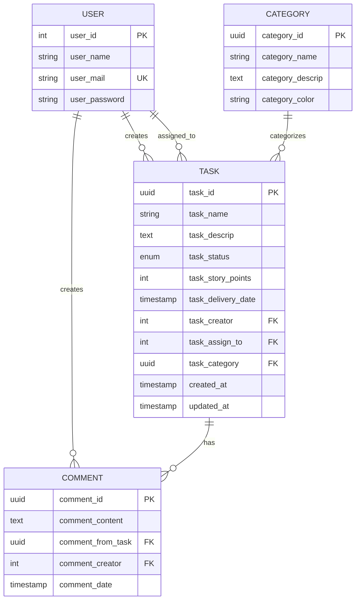
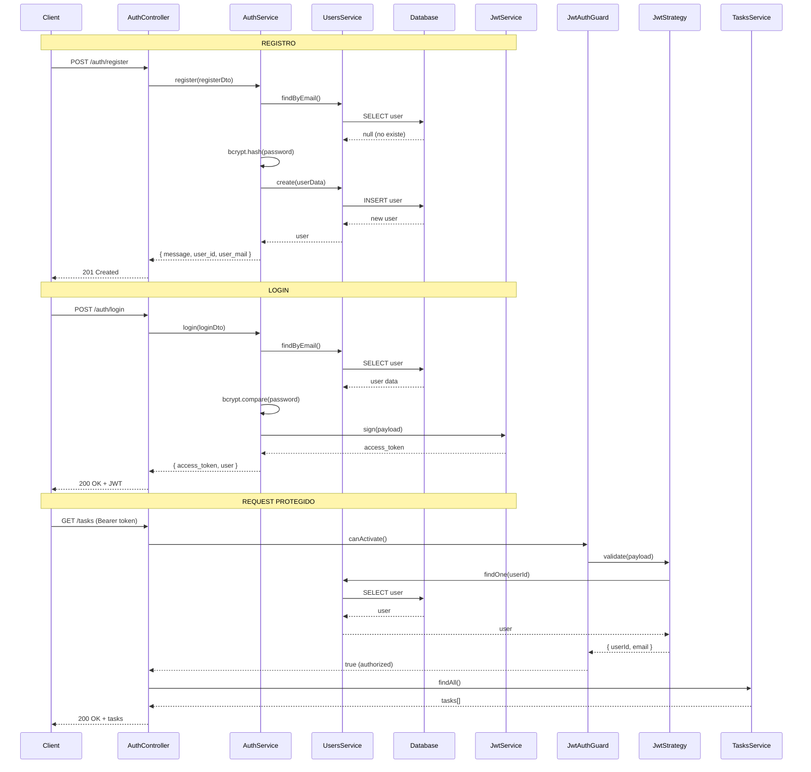
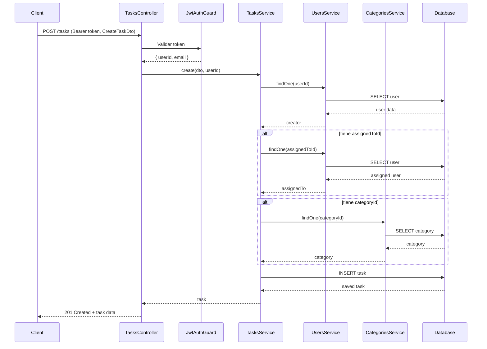

# 🚀 Análisis del Backend - API RESTful con NestJS

## 📋 Tabla de Contenidos

1. [Descripción General](#descripción-general)
2. [Arquitectura del Proyecto](#arquitectura-del-proyecto)
3. [Stack Tecnológico](#stack-tecnológico)
4. [Estructura de Directorios](#estructura-de-directorios)
5 [Base de Datos y Entidades](#base-de-datos-y-entidades)
6. [Módulos del Sistema](#módulos-del-sistema)
7. [Autenticación y Seguridad](#autenticación-y-seguridad)
8. [API Endpoints](#api-endpoints)
9. [Flujos de Datos](#flujos-de-datos)
10. [Configuración](#configuración)

---

## 🎯 Descripción General

Este es un **backend RESTful** construido con **NestJS** para una aplicación de gestión de tareas (Todo App). Implementa un sistema completo de autenticación JWT, gestión de usuarios, tareas, categorías y comentarios, con persistencia en PostgreSQL.

### Características Principales
- 🔐 **Autenticación JWT** con bcrypt para encriptación de contraseñas
- 👥 **Gestión de Usuarios** con validación de emails únicos
- ✅ **CRUD completo de Tareas** con asignación y categorización
- 🏷️ **Sistema de Categorías** personalizables con colores
- 💬 **Comentarios** en tareas
- 🛡️ **Guards** para protección de endpoints
- 📊 **TypeORM** para gestión de base de datos
- 📝 **Swagger** para documentación automática de API
- ✔️ **Validaciones** con class-validator

---

## 🏗️ Arquitectura del Proyecto

### Patrón de Arquitectura: **Modular**

NestJS utiliza una arquitectura modular donde cada funcionalidad está encapsulada en su propio módulo:

```
AppModule (Raíz)
├── AuthModule (Autenticación)
├── UsersModule (Gestión de usuarios)
├── TasksModule (Gestión de tareas)
├── CategoriesModule (Gestión de categorías)
└── CommentsModule (Gestión de comentarios)
```

### Componentes Principales por Módulo

Cada módulo sigue el patrón:
```
Module (Configuración)
├── Controller (Rutas HTTP)
├── Service (Lógica de negocio)
├── Entity (Modelo de datos)
└── DTOs (Data Transfer Objects - Validación)
```

---

## 🛠️ Stack Tecnológico

### Framework y Runtime
- **NestJS 11.0.1** - Framework Node.js
- **Node.js** - Runtime JavaScript
- **TypeScript 5.7.3** - Lenguaje tipado

### Base de Datos y ORM
- **PostgreSQL** - Base de datos relacional
- **TypeORM 0.3.28** - ORM (Object-Relational Mapping)
- **pg 8.16.3** - Driver de PostgreSQL

### Autenticación y Seguridad
- **@nestjs/jwt 11.0.2** - Manejo de JWT
- **@nestjs/passport 11.0.5** - Middleware de autenticación
- **passport-jwt 4.0.1** - Estrategia JWT para Passport
- **bcrypt 6.0.0** - Encriptación de contraseñas

### Validación
- **class-validator 0.14.3** - Validación de DTOs
- **class-transformer 0.5.1** - Transformación de objetos

### Documentación
- **@nestjs/swagger 11.2.4** - Generación de documentación OpenAPI

### Configuración
- **@nestjs/config 4.0.2** - Gestión de variables de entorno

---

## 📁 Estructura de Directorios

```
src/
├── app.module.ts              # Módulo raíz de la aplicación
├── app.controller.ts          # Controlador raíz
├── app.service.ts             # Servicio raíz
├── main.ts                    # Punto de entrada de la aplicación
│
├── auth/                      # Módulo de Autenticación
│   ├── auth.module.ts
│   ├── auth.controller.ts
│   ├── auth.service.ts
│   ├── dto/
│   │   ├── register.dto.ts
│   │   └── login.dto.ts
│   ├── guards/
│   │   └── jwt-auth.guard.ts
│   ├── strategies/
│   │   └── jwt.strategy.ts
│   └── decorators/
│       └── current-user.decorator.ts
│
├── users/                     # Módulo de Usuarios
│   ├── users.module.ts
│   ├── users.controller.ts
│   ├── users.service.ts
│   ├── entities/
│   │   └── user.entity.ts
│   └── dto/
│       ├── create-user.dto.ts
│       └── update-user.dto.ts
│
├── tasks/                     # Módulo de Tareas
│   ├── tasks.module.ts
│   ├── tasks.controller.ts
│   ├── tasks.service.ts
│   ├── entities/
│   │   └── task.entity.ts
│   └── dto/
│       ├── create-task.dto.ts
│       └── update-task-status.dto.ts
│
├── categories/                # Módulo de Categorías
│   ├── categories.module.ts
│   ├── categories.controller.ts
│   ├── categories.service.ts
│   ├── entities/
│   │   └── category.entity.ts
│   └── dto/
│       ├── create-category.dto.ts
│       └── update-category.dto.ts
│
└── comments/                  # Módulo de Comentarios
    ├── comments.module.ts
    ├── comments.controller.ts
    ├── comments.service.ts
    ├── entities/
    │   └── comment.entity.ts
    └── dto/
        ├── create-comment.dto.ts
        └── update-comment.dto.ts
```

---

## 🗄️ Base de Datos y Entidades

### Configuración de TypeORM

Ubicación: [`src/app.module.ts`](file:///c:/Users/Jeisi%20Rosales/Documents/ToDo%20List/todo-nestjs/src/app.module.ts#L23-L39)

```typescript
TypeOrmModule.forRootAsync({
  imports: [ConfigModule],
  inject: [ConfigService],
  useFactory: (configService: ConfigService) => ({
    type: 'postgres',
    host: configService.get('DB_HOST'),
    port: configService.get<number>('DB_PORT'),
    username: configService.get('DB_USER'),
    password: configService.get('DB_PASSWORD'),
    database: configService.get('DB_NAME'),
    entities: [__dirname + '/**/*.entity{.ts,.js}'],
    synchronize: true,  // ⚠️ SOLO en desarrollo
    logging: true,
  }),
})
```

> **⚠️ Importante:** `synchronize: true` crea/actualiza tablas automáticamente. En **producción** debe ser `false` y usar migraciones.

---

### Diagrama de Entidades



---

### Entidad User (Usuario)

**Ubicación:** [`src/users/entities/user.entity.ts`](file:///c:/Users/Jeisi%20Rosales/Documents/ToDo%20List/todo-nestjs/src/users/entities/user.entity.ts)

```typescript
@Entity({ name: 'users' })
export class User {
  @PrimaryGeneratedColumn({ name: 'user_id' })
  user_id: number;

  @Column({ name: 'user_name' })
  user_name: string;

  @Column({ name: 'user_mail', unique: true })
  user_mail: string;

  @Column({ name: 'user_password' })
  @ExcludeDecorator()  // No se retorna en JSON
  user_password: string;
}
```

**Características:**
- ID autoincremental numérico
- Email único (constraint de BD)
- Password excluido de respuestas JSON (seguridad)

---

### Entidad Task (Tarea)

**Ubicación:** [`src/tasks/entities/task.entity.ts`](file:///c:/Users/Jeisi%20Rosales/Documents/ToDo%20List/todo-nestjs/src/tasks/entities/task.entity.ts)

```typescript
export enum TaskStatus {
  PENDING = 'pending',
  IN_PROGRESS = 'in_progress',
  COMPLETED = 'completed',
  CANCELLED = 'cancelled',
}

@Entity('tasks')
export class Task {
  @PrimaryGeneratedColumn('uuid')
  task_id: string;

  @Column({ length: 200 })
  task_name: string;

  @Column({ type: 'text', nullable: true })
  task_descrip: string;

  @ManyToOne(() => User, { eager: true })
  @JoinColumn({ name: 'task_creator' })
  creator: User;

  @ManyToOne(() => User, { eager: true, nullable: true })
  @JoinColumn({ name: 'task_assign_to' })
  assignedTo: User;

  @Column({ type: 'int', default: 0 })
  task_story_points: number;

  @Column({ type: 'timestamp', nullable: true })
  task_delivery_date: Date;

  @ManyToOne(() => Category, { eager: true, nullable: true })
  @JoinColumn({ name: 'task_category' })
  category: Category;

  @Column({
    type: 'enum',
    enum: TaskStatus,
    default: TaskStatus.PENDING,
  })
  task_status: TaskStatus;

  @CreateDateColumn()
  created_at: Date;

  @UpdateDateColumn()
  updated_at: Date;
}
```

**Relaciones:**
- **ManyToOne con User (creator)** - Quien creó la tarea (eager: carga automáticamente)
- **ManyToOne con User (assignedTo)** - A quién se asignó (opcional)
- **ManyToOne con Category** - Categoría de la tarea (opcional)

**Características:**
- ID UUID (universally unique identifier)
- Timestamps automáticos (created_at, updated_at)
- Estado como enum para validación

---

### Entidad Category (Categoría)

**Ubicación:** [`src/categories/entities/category.entity.ts`](file:///c:/Users/Jeisi%20Rosales/Documents/ToDo%20List/todo-nestjs/src/categories/entities/category.entity.ts)

```typescript
@Entity('categories')
export class Category {
  @PrimaryGeneratedColumn('uuid')
  category_id: string;

  @Column({ length: 100 })
  category_name: string;

  @Column({ type: 'text', nullable: true })
  category_descrip: string;

  @Column({ length: 7, default: '#3B82F6' })
  category_color: string;
}
```

**Características:**
- ID UUID
- Color en formato hexadecimal (#RRGGBB)
- Color por defecto: #3B82F6 (azul)

---

### Entidad Comment (Comentario)

**Ubicación:** [`src/comments/entities/comment.entity.ts`](file:///c:/Users/Jeisi%20Rosales/Documents/ToDo%20List/todo-nestjs/src/comments/entities/comment.entity.ts)

```typescript
@Entity('comments')
export class Comment {
  @PrimaryGeneratedColumn('uuid')
  comment_id: string;

  @Column({ type: 'text' })
  comment_content: string;

  @ManyToOne(() => Task, { eager: false })
  @JoinColumn({ name: 'comment_from_task' })
  task: Task;

  @ManyToOne(() => User, { eager: true })
  @JoinColumn({ name: 'comment_creator' })
  creator: User;

  @CreateDateColumn()
  comment_date: Date;
}
```

**Relaciones:**
- **ManyToOne con Task** - Tarea a la que pertenece (no eager)
- **ManyToOne con User (creator)** - Quien creó el comentario (eager)

---

## 🔐 Autenticación y Seguridad

### Flujo de Autenticación



---

### AuthService (Lógica de Autenticación)

**Ubicación:** [`src/auth/auth.service.ts`](file:///c:/Users/Jeisi%20Rosales/Documents/ToDo%20List/todo-nestjs/src/auth/auth.service.ts)

#### Registro de Usuario

```typescript
async register(registerDto: RegisterDto) {
  // 1. Verificar si email ya existe
  const existingUser = await this.usersService.findByEmail(registerDto.user_mail);
  if (existingUser) {
    throw new ConflictException('El email ya está registrado');
  }

  // 2. Hash del password con bcrypt (10 salt rounds)
  const hashedPassword = await bcrypt.hash(registerDto.user_password, 10);

  // 3. Crear usuario
  const user = await this.usersService.create({
    ...registerDto,
    user_password: hashedPassword,
  });

  return {
    message: 'Usuario registrado exitosamente',
    user_id: user.user_id,
    user_mail: user.user_mail,
  };
}
```

**Validación del DTO:**
```typescript
export class RegisterDto {
  @IsString()
  @IsNotEmpty()
  user_name: string;

  @IsEmail()
  user_mail: string;

  @IsString()
  @MinLength(6)
  user_password: string;
}
```

---

#### Login de Usuario

```typescript
async login(loginDto: LoginDto) {
  // 1. Buscar usuario por email
  const user = await this.usersService.findByEmail(loginDto.user_mail);
  if (!user) {
    throw new UnauthorizedException('Credenciales inválidas');
  }

  // 2. Comparar password con hash
  const isPasswordValid = await bcrypt.compare(
    loginDto.user_password,
    user.user_password
  );
  if (!isPasswordValid) {
    throw new UnauthorizedException('Credenciales inválidas');
  }

  // 3. Generar JWT
  const payload = { sub: user.user_id, email: user.user_mail };
  const access_token = this.jwtService.sign(payload);

  return {
    access_token,
    user: {
      user_id: user.user_id,
      user_name: user.user_name,
      user_mail: user.user_mail,
    },
  };
}
```

**Estructura del JWT Payload:**
```json
{
  "sub": 1,           // user_id
  "email": "user@example.com",
  "iat": 1234567890,  // Issued At (automático)
  "exp": 1234571490   // Expiration (automático, basado en JWT_EXPIRATION)
}
```

---

### JWT Strategy (Validación de Tokens)

**Ubicación:** [`src/auth/strategies/jwt.strategy.ts`](file:///c:/Users/Jeisi%20Rosales/Documents/ToDo%20List/todo-nestjs/src/auth/strategies/jwt.strategy.ts)

```typescript
@Injectable()
export class JwtStrategy extends PassportStrategy(Strategy) {
  constructor(
    private configService: ConfigService,
    private usersService: UsersService,
  ) {
    super({
      jwtFromRequest: ExtractJwt.fromAuthHeaderAsBearerToken(),
      ignoreExpiration: false,  // Rechaza tokens expirados
      secretOrKey: configService.get('JWT_SECRET') || 'secretKey',
    });
  }

  async validate(payload: any) {
    // Verificar que el usuario aún existe
    const user = await this.usersService.findOne(payload.sub);
    if (!user) {
      throw new UnauthorizedException();
    }

    // Se inyecta en request.user
    return { userId: payload.sub, email: payload.email };
  }
}
```

**Funcionamiento:**
1. Extrae el token del header `Authorization: Bearer <token>`
2. Verifica la firma con `JWT_SECRET`
3. Verifica que no esté expirado
4. Ejecuta `validate()` con el payload decodificado
5. Lo que retorna `validate()` se inyecta en `request.user`

---

### JWT Auth Guard (Protección de Rutas)

**Ubicación:** [`src/auth/guards/jwt-auth.guard.ts`](file:///c:/Users/Jeisi%20Rosales/Documents/ToDo%20List/todo-nestjs/src/auth/guards/jwt-auth.guard.ts)

```typescript
@Injectable()
export class JwtAuthGuard extends AuthGuard('jwt') {}
```

**Uso en Controladores:**

```typescript
@Controller('tasks')
@UseGuards(JwtAuthGuard)  // Protege todas las rutas
export class TasksController {
  @Post()
  create(@Body() dto: CreateTaskDto, @CurrentUser() user: any) {
    // user.userId está disponible gracias al guard
    return this.tasksService.create(dto, user.userId);
  }
}
```

**Custom Decorator `@CurrentUser()`:**
```typescript
export const CurrentUser = createParamDecorator(
  (data: unknown, ctx: ExecutionContext) => {
    const request = ctx.switchToHttp().getRequest();
    return request.user;  // Viene de JwtStrategy.validate()
  },
);
```

---

## 📡 Módulos del Sistema

### 1. UsersModule (Usuarios)

**Service Principal:** [`users.service.ts`](file:///c:/Users/Jeisi%20Rosales/Documents/ToDo%20List/todo-nestjs/src/users/users.service.ts)

```typescript
@Injectable()
export class UsersService {
  constructor(
    @InjectRepository(User)
    private usersRepository: Repository<User>,
  ) {}

  async create(createUserDto: CreateUserDto): Promise<User> {
    const user = this.usersRepository.create(createUserDto);
    return await this.usersRepository.save(user);
  }

  async findByEmail(email: string): Promise<User | null> {
    return await this.usersRepository.findOne({
      where: { user_mail: email },
    });
  }

  async findOne(id: number): Promise<User | null> {
    return await this.usersRepository.findOne({
      where: { user_id: id },
    });
  }

  async findAll(): Promise<User[]> {
    return await this.usersRepository.find();
  }
}
```

**Funciones:**
- Crear usuarios
- Buscar por email (para login)
- Buscar por ID
- Listar todos

---

### 2. TasksModule (Tareas)

**Service Principal:** [`tasks.service.ts`](file:///c:/Users/Jeisi%20Rosales/Documents/ToDo%20List/todo-nestjs/src/tasks/tasks.service.ts)

```typescript
@Injectable()
export class TasksService {
  constructor(
    @InjectRepository(Task)
    private tasksRepository: Repository<Task>,
    private usersService: UsersService,
    private categoriesService: CategoriesService,
  ) {}

  async create(createTaskDto: CreateTaskDto, creatorId: string): Promise<Task> {
    const creator = await this.usersService.findOne(+creatorId);
    if (!creator) {
      throw new NotFoundException('User (creator) not found');
    }

    const task = this.tasksRepository.create({
      task_name: createTaskDto.task_name,
      task_descrip: createTaskDto.task_descrip,
      task_story_points: createTaskDto.task_story_points,
      task_delivery_date: createTaskDto.task_delivery_date
        ? new Date(createTaskDto.task_delivery_date)
        : undefined,
      task_status: createTaskDto.task_status,
      creator,
    });

    // Asignar usuario si se especifica
    if (createTaskDto.assignedToId) {
      const assignedUser = await this.usersService.findOne(+createTaskDto.assignedToId);
      if (assignedUser) {
        task.assignedTo = assignedUser;
      }
    }

    // Asignar categoría si se especifica
    if (createTaskDto.categoryId) {
      const category = await this.categoriesService.findOne(createTaskDto.categoryId);
      if (category) {
        task.category = category;
      }
    }

    return await this.tasksRepository.save(task);
  }

  async findAll(): Promise<Task[]> {
    return await this.tasksRepository.find({
      relations: ['creator', 'assignedTo', 'category'],
    });
  }

  async updateStatus(id: string, updateStatusDto: UpdateTaskStatusDto): Promise<Task> {
    const task = await this.findOne(id);
    task.task_status = updateStatusDto.task_status;
    return await this.tasksRepository.save(task);
  }
}
```

**Funciones:**
- Crear tareas con relaciones
- Listar con eager loading de relaciones
- Actualizar estado
- Eliminar tareas

---

### 3. CategoriesModule (Categorías)

**Service Principal:** [`categories.service.ts`](file:///c:/Users/Jeisi%20Rosales/Documents/ToDo%20List/todo-nestjs/src/categories/categories.service.ts)

```typescript
@Injectable()
export class CategoriesService {
  constructor(
    @InjectRepository(Category)
    private categoriesRepository: Repository<Category>,
  ) {}

  async create(createCategoryDto: CreateCategoryDto): Promise<Category> {
    const category = this.categoriesRepository.create(createCategoryDto);
    return await this.categoriesRepository.save(category);
  }

  async update(id: string, updateCategoryDto: UpdateCategoryDto): Promise<Category> {
    const category = await this.findOne(id);
    Object.assign(category, updateCategoryDto);
    return await this.categoriesRepository.save(category);
  }
}
```

**DTO con Validación:**
```typescript
export class CreateCategoryDto {
  @IsString()
  @IsNotEmpty()
  category_name: string;

  @IsString()
  @IsOptional()
  category_descrip?: string;

  @IsString()
  @IsOptional()
  @Matches(/^#[0-9A-Fa-f]{6}$/, { 
    message: 'Color debe ser formato HEX (#RRGGBB)' 
  })
  category_color?: string;
}
```

---

### 4. CommentsModule (Comentarios)

**Controller:** [`comments.controller.ts`](file:///c:/Users/Jeisi%20Rosales/Documents/ToDo%20List/todo-nestjs/src/comments/comments.controller.ts)

```typescript
@Controller('tasks/comments')
@UseGuards(JwtAuthGuard)
export class CommentsController {
  @Post(':taskId')
  create(
    @Param('taskId') taskId: string,
    @Body() createCommentDto: CreateCommentDto,
    @CurrentUser() user: any,
  ) {
    return this.commentsService.create(taskId, createCommentDto, user.userId);
  }

  @Get(':taskId')
  findByTask(@Param('taskId') taskId: string) {
    return this.commentsService.findByTask(taskId);
  }
}
```

---

## 🌐 API Endpoints

### Autenticación (Sin Protección)

| Método | Endpoint | Descripción | Body |
|--------|----------|-------------|------|
| POST | `/auth/register` | Registrar usuario | `{ user_name, user_mail, user_password }` |
| POST | `/auth/login` | Iniciar sesión | `{ user_mail, user_password }` |

### Tareas (Protegidas con JWT)

| Método | Endpoint | Descripción |
|--------|----------|-------------|
| POST | `/tasks` | Crear tarea |
| GET | `/tasks` | Listar todas |
| GET | `/tasks/:id` | Obtener por ID |
| PATCH | `/tasks/:id/status` | Actualizar estado |
| DELETE | `/tasks/:id` | Eliminar tarea |

### Categorías (Protegidas con JWT)

| Método | Endpoint | Descripción |
|--------|----------|-------------|
| POST | `/categories` | Crear categoría |
| GET | `/categories` | Listar todas |
| GET | `/categories/:id` | Obtener por ID |
| PATCH | `/categories/:id` | Actualizar |
| DELETE | `/categories/:id` | Eliminar |

### Comentarios (Protegidas con JWT)

| Método | Endpoint | Descripción |
|--------|----------|-------------|
| POST | `/tasks/comments/:taskId` | Crear comentario |
| GET | `/tasks/comments/:taskId` | Listar por tarea |
| PATCH | `/tasks/comments/:taskId` | Actualizar |
| DELETE | `/tasks/comments/:taskId` | Eliminar |

---

## ⚙️ Configuración

### Variables de Entorno (.env)

```env
# Base de Datos
DB_HOST=localhost
DB_PORT=5432
DB_USER=postgres
DB_PASSWORD=tu_password
DB_NAME=todo_db

# JWT
JWT_SECRET=tu_secreto_super_seguro_aqui
JWT_EXPIRATION=1h
```

### Punto de Entrada (main.ts)

**Ubicación:** [`src/main.ts`](file:///c:/Users/Jeisi%20Rosales/Documents/ToDo%20List/todo-nestjs/src/main.ts)

```typescript
async function bootstrap() {
  const app = await NestFactory.create(AppModule);
  
  // Habilitar CORS para frontend
  app.enableCors();

  // Validaciones globales
  app.useGlobalPipes(
    new ValidationPipe({
      whitelist: true,           // Remueve propiedades no definidas en DTO
      forbidNonWhitelisted: true, // Lanza error si hay propiedades extra
      transform: true,            // Transforma tipos automáticamente
    }),
  );

  // Swagger en /api/docs
  const config = new DocumentBuilder()
    .setTitle('Todo App API')
    .setDescription('API RESTful para gestión de tareas con NestJS')
    .setVersion('1.0')
    .addBearerAuth()
    .build();
    
  const document = SwaggerModule.createDocument(app, config);
  SwaggerModule.setup('api/docs', app, document);

  await app.listen(3000);
  console.log(`🚀 Aplicación corriendo en: http://localhost:3000`);
  console.log(`📚 Documentación Swagger: http://localhost:3000/api/docs`);
}
bootstrap();
```

---

## 📊 Flujos de Datos Completos

### Crear una Tarea



---

## 🚀 Comandos Útiles

```bash
# Desarrollo
npm run start:dev

# Producción
npm run build
npm run start:prod

# Testing
npm run test
npm run test:e2e

# Linting
npm run lint
```

---

## 📝 Notas Importantes

### Seguridad
✅ Passwords hasheados con bcrypt (10 salt rounds)  
✅ JWT con expiración configurable  
✅ Guards en todas las rutas protegidas  
✅ Validaciones en todos los DTOs  
✅ @Exclude en password para no exponerlo  

### Base de Datos
⚠️ `synchronize: true` solo en desarrollo  
✅ Eager loading en relaciones importantes  
✅ UUIDs para IDs de tareas, categorías y comentarios  
✅ Constraints de unicidad (email)  

### Best Practices
✅ Arquitectura modular  
✅ Inyección de dependencias  
✅ DTOs para validación  
✅ Manejo de errores con excepciones de Nest  
✅ Documentación Swagger automática  

---

## 🎯 Resumen

Este backend implementa una **arquitectura sólida y escalable** con NestJS, siguiendo las mejores prácticas:

- **Seguridad robusta** con JWT y bcrypt
- **Validaciones exhaustivas** con class-validator
- **ORM potente** con TypeORM
- **Código bien organizado** en módulos
- **Documentación automática** con Swagger
- **Listo para producción** con configuración por entorno

El sistema está **completamente funcional** y listo para integrarse con el frontend Next.js.
